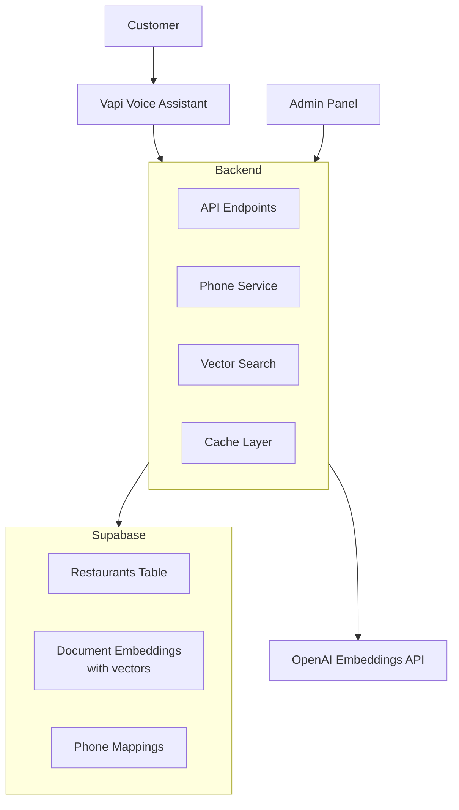

# Restaurant Voice Assistant Backend

Multi-tenant voice assistant backend for restaurants using Vapi.ai, FastAPI, Supabase (pgvector), and OpenAI embeddings.

## Features

- **Multi-tenancy**: Data isolation per restaurant using `restaurant_id`
- **Voice Integration**: Vapi.ai voice assistant with function tools
- **Vector Search**: Semantic search using pgvector and OpenAI embeddings
- **Automated Phone Provisioning**: Programmatic Twilio phone number assignment
- **Cost-Efficient**: Single shared Vapi assistant for all restaurants
- **Caching**: In-memory caching for frequently accessed data

## Quick Start

1. **Setup Environment**: Copy `.env.example` to `.env` and configure variables (see [Environment Variables](docs/ENVIRONMENT_VARIABLES.md))
2. **Database Setup**: Run migrations in Supabase SQL Editor (see [Setup Guide](docs/SETUP.md#database-setup))
3. **Run Locally**: `docker-compose up`
4. **Configure Vapi**: `docker-compose exec api python -m scripts.setup_vapi`
5. **Seed Data**: `docker-compose exec api python -m scripts.seed_database --restaurant-name "Your Restaurant" --generate-embeddings`

See [Setup Guide](docs/SETUP.md) for detailed instructions.

## Architecture



## Documentation

- **[Setup Guide](docs/SETUP.md)** - Detailed setup instructions
- **[Architecture](docs/ARCHITECTURE.md)** - System design and data flows
- **[API Reference](docs/API.md)** - Endpoint documentation
- **[Environment Variables](docs/ENVIRONMENT_VARIABLES.md)** - Configuration reference
- **[Phone Number Automation](docs/PHONE_NUMBER_AUTOMATION.md)** - Twilio integration guide

## Tech Stack

- **FastAPI** - Web framework
- **Supabase** - PostgreSQL with pgvector extension
- **OpenAI** - Embeddings (text-embedding-3-small)
- **Vapi.ai** - Voice AI platform
- **Twilio** - Phone number provisioning
- **Docker** - Containerization

## API Endpoints

- `POST /api/restaurants` - Create restaurant (auto-assigns phone)
- `POST /api/vapi/knowledge-base` - Vapi webhook for tool calls
- `POST /api/vapi/assistant-request` - Extract restaurant_id from phone
- `POST /api/embeddings/generate` - Generate embeddings
- `GET /api/calls` - List call history
- `POST /api/calls` - Create call record

See [API Reference](docs/API.md) for complete documentation.

## Project Structure

```
backend/
├── src/                    # Application code
│   ├── api/               # FastAPI routes
│   ├── models/            # Pydantic models
│   └── services/          # Business logic
├── vapi/                  # Vapi integration
│   ├── client.py          # Vapi API client
│   ├── manager.py         # Resource manager
│   └── config/            # YAML configurations
├── scripts/               # Utility scripts
│   ├── setup_vapi.py      # Vapi assistant/tools setup
│   ├── seed_database.py   # Database seeding
│   └── create_twilio_phone_numbers.py  # Batch phone creation
├── supabase/
│   └── migrations/       # Database migrations
└── docs/                  # Documentation
```

## License

Free to use
