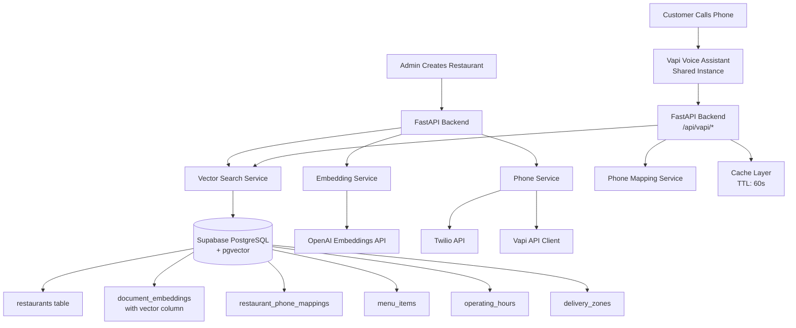
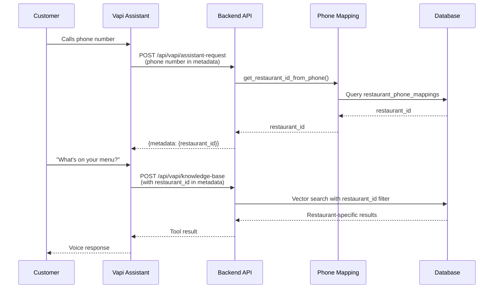
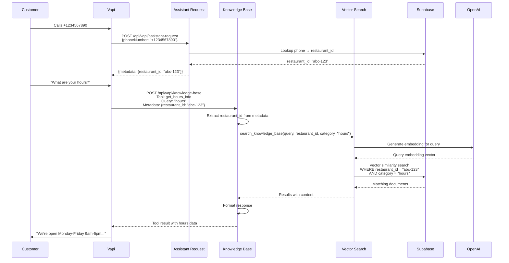
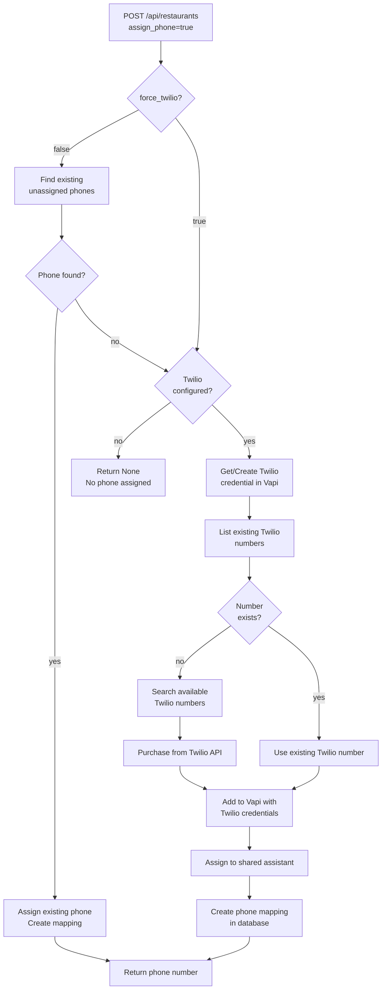
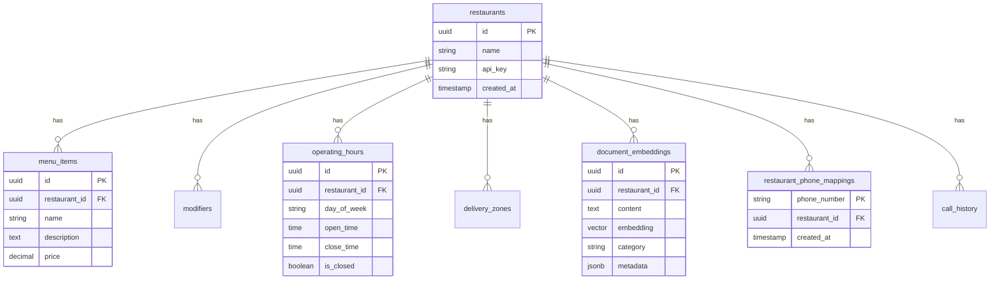

# Architecture

System architecture and design patterns for the Restaurant Voice Assistant backend.

## Overview

The system provides a multi-tenant voice assistant backend where each restaurant has isolated data but shares a single Vapi assistant instance for cost efficiency. Phone numbers are mapped to restaurants for routing.

## System Architecture

## Multi-Tenant Routing

The system uses phone number mapping to route calls to the correct restaurant:

## Voice Call Flow

Complete flow from customer call to voice response:

## Phone Assignment Flow

How phone numbers are assigned to restaurants:

## Database Schema

Key tables and relationships:

## Component Responsibilities

### FastAPI Backend (`src/main.py`)

- Main application entry point
- CORS middleware configuration
- Global exception handling
- Route registration

### API Endpoints (`src/api/`)

- **restaurants.py**: Restaurant CRUD, phone assignment
- **vapi.py**: Vapi webhooks (assistant-request, knowledge-base)
- **embeddings.py**: Embedding generation, cache invalidation
- **calls.py**: Call history management
- **health.py**: Health check endpoint

### Services (`src/services/`)

- **phone_service.py**: Phone assignment orchestration
- **phone_mapping.py**: Phone → restaurant_id mapping
- **twilio_service.py**: Twilio API integration
- **vector_search.py**: Vector similarity search
- **embedding_service.py**: OpenAI embeddings generation
- **cache.py**: In-memory caching (TTL: 60s)
- **vapi_response.py**: Vapi response formatting

### Vapi Integration (`vapi/`)

- **client.py**: Vapi API client wrapper
- **manager.py**: Resource manager (tools, assistants)
- **config_loader.py**: YAML configuration loader
- **config/**: Tool and assistant YAML configurations

## Data Flow Patterns

### Query Processing

1. **Extract** restaurant_id from phone number or metadata
2. **Generate** embedding for user query (OpenAI)
3. **Search** vector database with restaurant_id filter (Supabase pgvector)
4. **Cache** results for 60 seconds
5. **Format** response for Vapi tool result

### Phone Assignment

1. **Check** for existing unassigned phones (unless `force_twilio=True`)
2. **Create** Twilio credential in Vapi (if needed)
3. **Purchase** phone from Twilio API (if needed)
4. **Register** phone in Vapi with credentials
5. **Assign** phone to shared assistant
6. **Create** phone mapping in database

### Multi-Tenancy Isolation

- All queries filtered by `restaurant_id`
- Row Level Security (RLS) policies in Supabase
- Service role key used for writes (bypasses RLS)
- Anon key used for reads (respects RLS)

## Caching Strategy

- **Cache Key**: `{restaurant_id}:{category}:{query}`
- **TTL**: 60 seconds (configurable via `CACHE_TTL_SECONDS`)
- **Invalidation**: Manual via `/api/embeddings/cache/invalidate`
- **Storage**: In-memory (TTLCache from cachetools)

## Security

- **Vapi Webhooks**: HMAC verification via `X-Vapi-Secret` header
- **API Endpoints**: Protected by `VAPI_SECRET_KEY`
- **Database**: RLS policies for multi-tenant isolation
- **Service Role**: Only used for admin operations (writes)

## Cost Optimization

- **Single Vapi Assistant**: Shared across all restaurants
- **Phone Reuse**: Assigns existing phones before creating new ones
- **Caching**: Reduces OpenAI embedding API calls
- **Vector Search**: Efficient pgvector indexing

## Scalability Considerations

- **Horizontal Scaling**: Stateless FastAPI app, can run multiple instances
- **Database**: Supabase scales PostgreSQL automatically
- **Caching**: Consider Redis for multi-instance deployments
- **Phone Limits**: Twilio account quotas apply per restaurant

