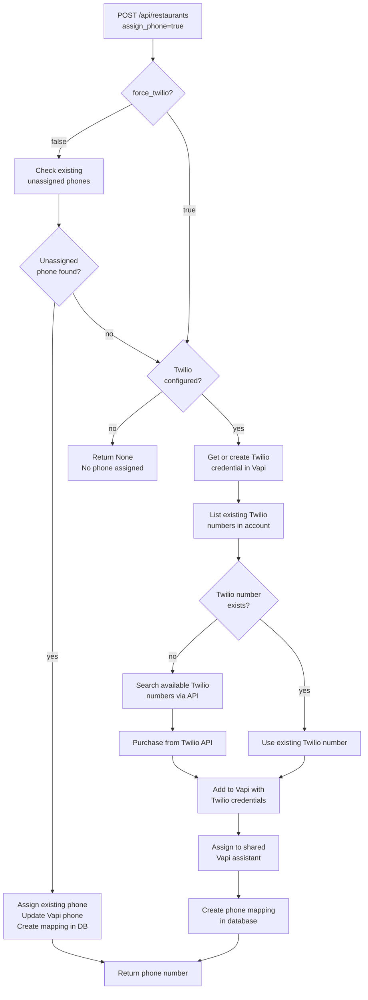

# Phone Number Automation Guide

## Overview

This document explains how to automatically create and assign phone numbers for multi-tenant testing.

## Phone Assignment Flow



## Available Options

### 1. **Twilio (Automatic via API)** - RECOMMENDED FOR AUTOMATION

Twilio provides an API to automatically search, purchase, and provision phone numbers programmatically.

**How it works:**

The system automatically:

1. **Creates Twilio credentials in Vapi** (programmatically via API - no manual dashboard!)
2. Searches for available Twilio phone numbers via Twilio API
3. Attempts to purchase new numbers via Twilio API
4. Handles trial account limits gracefully (falls back to existing number)
5. Adds purchased numbers to Vapi using the credential
6. Assigns them to restaurants

**Trial vs Paid Account Behavior:**

| Account Type      | Behavior                                                                                                                                                                                                                      |
| ----------------- | ----------------------------------------------------------------------------------------------------------------------------------------------------------------------------------------------------------------------------- |
| **Trial Account** | System attempts to purchase new numbers. If trial limit (1 number max) is reached, automatically falls back to reusing the existing number. Each new restaurant creation will try to purchase first, then reuse if limit hit. |
| **Paid Account**  | System automatically purchases new numbers for each restaurant. No limits, fully automatic provisioning.                                                                                                                      |

**Upgrading from Trial to Paid:**

1. **Add payment method** to your Twilio account (via Twilio Console)
2. **No code changes required** - the system automatically detects the upgrade
3. **Next restaurant creation** will automatically purchase a new number
4. **All subsequent restaurants** get unique phone numbers automatically

The code is designed to:

- Always attempt to purchase new numbers first
- Handle trial limits gracefully (reuse existing number)
- Automatically enable full provisioning when account is upgraded
- No configuration or code changes needed after upgrade

**Setup:**

1. Sign up for Twilio: https://www.twilio.com/
2. Get your Account SID and Auth Token from Twilio Console
3. Set environment variables:
   ```bash
   TWILIO_ACCOUNT_SID=your_account_sid
   TWILIO_AUTH_TOKEN=your_auth_token
   ```

**Script:**

```bash
docker-compose exec api python scripts/create_twilio_phone_numbers.py
```

**Requirements:**

- `requests` library (already in requirements.txt)
- Twilio Account SID and Auth Token
- Twilio account (trial or paid - works with both)
  - **Trial:** Limited to 1 phone number, system reuses it for new restaurants
  - **Paid:** Unlimited numbers, each restaurant gets a unique number automatically

**Pros:**

- Fully automated via API (search → purchase → assign)
- No manual dashboard interaction
- Can create multiple numbers programmatically
- Uses Twilio's native search/purchase API

**Cons:**

- Requires Twilio account (trial or paid)
- Needs Twilio credentials (Account SID + Auth Token)
- Trial accounts limited to 1 number (paid accounts have no limits)
- Costs apply per number purchased (Twilio pricing)

---

### 3. **Other Providers (Vonage, Telnyx)**

Similar to Twilio, other providers can be used with credentials.

**Setup:**
Requires provider-specific credentials and configuration.

---

## Current System Behavior

When creating a restaurant via API:

- `POST /api/restaurants` with `assign_phone=True` (default)
- System automatically assigns available phone numbers
- **Smart assignment logic:**
  1. First checks for existing unassigned Vapi phone numbers
  2. If none found and Twilio is configured, attempts to purchase a new Twilio number
  3. **Trial accounts:** Falls back to reusing existing number if purchase fails due to limit
  4. **Paid accounts:** Successfully purchases new numbers for each restaurant
- Falls back gracefully if no numbers available or Twilio not configured

## Recommended Workflow

### For Development/Testing:

1. Use **Twilio** for fully automated provisioning (recommended)

### For Production:

1. Use **Twilio** for automatic provisioning (recommended)

## Scripts Available

- `scripts/create_twilio_phone_numbers.py` - Creates numbers via Twilio API (fully automated)
- `scripts/delete_twilio_phone.py` - Delete Twilio phone numbers from Vapi

## Automatic Assignment via API

When creating a restaurant, phone assignment happens automatically:

```bash
curl -X POST http://localhost:8000/api/restaurants \
  -H "Content-Type: application/json" \
  -H "X-Vapi-Secret: your_secret" \
  -d '{
    "name": "My Restaurant",
    "assign_phone": true,
    "force_twilio": false
  }'
```

**Behavior:**

- `assign_phone=true, force_twilio=false`: Tries existing phones first, then Twilio
- `assign_phone=true, force_twilio=true`: Skips existing phones, directly creates Twilio number
- `assign_phone=false`: No phone assignment

## Manual Batch Operations

For assigning phones to multiple existing restaurants:

```bash
docker-compose exec api python -m scripts.create_twilio_phone_numbers
```

This script:

1. Finds restaurants without phone mappings
2. Creates Twilio phone numbers for each
3. Assigns them to the shared assistant
4. Creates database mappings
